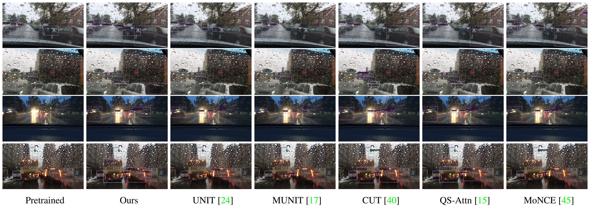

<h1 align="center">[WACV 2024] TPSeNCE: Towards Artifact-Free Realistic Rain Generation for Deraining and Object Detection in Rain</h1>

<p align="center">
    <a href="https://openaccess.thecvf.com/content/WACV2024/papers/Zheng_TPSeNCE_Towards_Artifact-Free_Realistic_Rain_Generation_for_Deraining_and_Object_WACV_2024_paper.pdf">Paper</a> |
    <a href="https://openaccess.thecvf.com/content/WACV2024/supplemental/Zheng_TPSeNCE_Towards_Artifact-Free_WACV_2024_supplemental.pdf">Supp</a> |
    <a href="https://shenzheng2000.github.io/tpsence.github.io/">Webpage</a>
</p>

# Title

<b>TPSeNCE: Towards Artifact-Free Realistic Rain Generation for Deraining and Object Detection in Rain</b>
<br>_[Shen Zheng](https://shenzheng2000.github.io/), [Changjie Lu](https://louey233.github.io/), [Srinivasa Narasimhan](https://www.cs.cmu.edu/~srinivas/)_<br>
In WACV 2024


# Updates 

(12/20: WACV link is available)

(12/17: Update deraining instructions)

(11/28: Upload checkpoints for night and snowy.)

# Model Overview
<p align="center">
  
</p>


# Image Results


## Rain Generation (Clear to Rainy)
<p align="center">
  
</p>


## Deraining (Rainy to Clear)
<p align="center">
  
</p>


## Object Detection in Rain
<p align="center">
  
</p>

# Video Results

Rain Generation Video [[here](https://www.youtube.com/watch?v=eNS_8fuSLjc)]

Object Detection Video [[here](https://www.youtube.com/watch?v=RkGmAAORugc)]


# Getting Started
```
git clone https://github.com/ShenZheng2000/TPSeNCE.git
```


# Dependencies
```
pip install -r requirements.txt
```


# Dataset Download


Download training and testing images from [[here](https://drive.google.com/drive/folders/1o_M3p8OLURm4wo8pcD0EQclH6feyXlcm?usp=drive_link)]

# Dataset Explanations
Suppose we are translating clear images to rainy images, then we should put images under /path_to_your_dataset/ like this.

```
A: source images (e.g., clear images)
B: target images (e.g., rainy images)
S: sem. seg. maps of A
T: sem. seg. maps of B
```


# Dataset Folder Structure
```
/path_to_your_dataset/
    ├── trainA
    ├── trainB
    ├── trainS
    ├── trainT
    ├── testA
    ├── testB
    ├── testS
    ├── testT
```


## NOTE1: Avoiding Empty Test Folders
testS and testT is not used for training or testing. However, make sure to include images in the testS and testT folders to prevent them from being empty, as an empty folder cause error during training and testing. 

In convenience, we suggest that you use the following command to avoid empty folder.
```
cp -r testA testS
cp -r testB testT
```

## NOTE2: Obtaining Semantic Segmentation Maps
As ground truth semantic segmentation maps are not available for BDD100K, we estimate these maps using the [[ConvNeXt-XL](https://github.com/open-mmlab/mmsegmentation/tree/main/configs/convnext)] model from the [[MMSegmentation](https://github.com/open-mmlab/mmsegmentation/)] toolbox. If you are working with a dataset like [[Cityscapes](https://www.cityscapes-dataset.com/)] which already includes ground truth semantic segmentation maps, the semantic guidance can be expected to be more effective.


# Training from scratch
Run in terminal.
```
bash train.sh
```


# Testing with pretrained model
1. Download the checkpoints from [[here](https://drive.google.com/drive/folders/1CsQ1yssNl_WULkwkT8_zz6-j4D56Gfv8?usp=drive_link)]

2. Unzip the checkpoints.

3. Create folder `bdd100k_1_20`, `INIT`, and `boreas_snowy` under `./checkpoints` like below. 

```
/TPSeNCE/
    ├── checkpoints
    │   ├── bdd100k_1_20                       (clear2rainy)
    │   ├── INIT                               (clear2rainy)
    |   ├── boreas_snowy                       (clearsnowy)
    |   ├── bdd100k_7_19_night_tri_sem         (day2night)
    |   ├── bdd100k_7_20_snowy_tri_sem         (clear2snowy)
```

4. Run in terminal
```
bash test.sh
```

# Deraining Experiments 

1. Choose one of the deraining methods below:
（1）[EffDerain](https://github.com/tsingqguo/efficientderain)
（2）[VRGNet](https://github.com/hongwang01/VRGNet)
（3）[PreNet](https://github.com/csdwren/PReNet)
（4）[SAPNet](https://github.com/ShenZheng2000/SAPNet-for-image-deraining)

2. Use TPSeNCE with checkpoint `bdd100k_1_20` for testing (clear -> rainy)

3. Use deraining methods for training (rainy -> clear)

4. Extract `Rainy_bad.zip` to obtain `Rainy_bad`

5. Perform inference on deraining methods for 100 heavy rain images inside  `Rainy_bad`, or any other real rainy images you prefer.


# Citation

If you find this work helpful, please cite

```
@InProceedings{Zheng_2024_WACV,
    author    = {Zheng, Shen and Lu, Changjie and Narasimhan, Srinivasa G.},
    title     = {TPSeNCE: Towards Artifact-Free Realistic Rain Generation for Deraining and Object Detection in Rain},
    booktitle = {Proceedings of the IEEE/CVF Winter Conference on Applications of Computer Vision (WACV)},
    month     = {January},
    year      = {2024},
    pages     = {5394-5403}
}
```


# Acknowledgment

This repository is heavily based upon [[MoNCE](https://github.com/fnzhan/MoNCE)] and [[CUT](https://github.com/taesungp/contrastive-unpaired-translation)]. 

This work is supported in part by General Motors.


<!-- The specific lines of code are as follows.
```
python test.py \
--dataroot /root/autodl-tmp/Datasets/bdd100k_1_20 \
--results_dir ./results_test_a2b/ \
--num_test 4025 \
--gpu_ids 0 \
--name bdd100k_1_20 \
--phase test \
--preprocess scale_width \
--load_size 640
```

Here are some explanations:
```
dataroot: 
    path_to_your_dataset
results_dir: 
    path_for_output_images
num_test: 
    numbers of images you want to test
gpu_ids: 
    gpu id (only supports single gpu for testing)
name: 
    folder mame under ./checkpoints
phase: 
    train or test
preprocess: 
    scale_width (by default)
load_size: 
    640 for BDD, 572 for INIT, 430 for Boreas
``` -->
